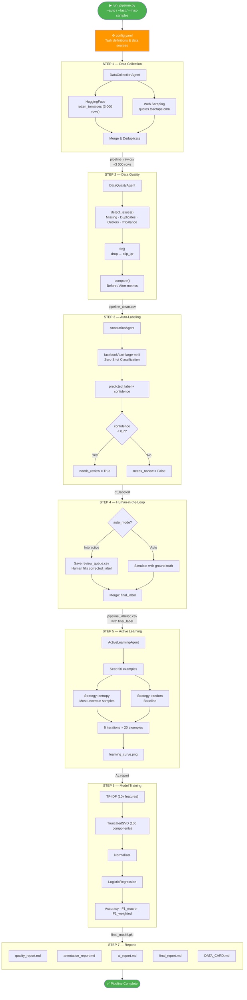

# Pipeline Overview — General Architecture

```mermaid
flowchart TD
    START(["▶ run_pipeline.py\n--auto / --fast / --max-samples"])
    CONFIG["⚙️ config.yaml\nTask definitions & data sources"]

    START --> CONFIG

    CONFIG --> STEP1

    subgraph STEP1 ["STEP 1 — Data Collection"]
        direction TB
        A1["DataCollectionAgent"]
        A2["HuggingFace\nrotten_tomatoes (3 000 rows)"]
        A3["Web Scraping\nquotes.toscrape.com"]
        A4["Merge & Deduplicate"]
        A2 --> A4
        A3 --> A4
        A1 --> A2
        A1 --> A3
    end

    STEP1 -->|"pipeline_raw.csv\n~3 000 rows"| STEP2

    subgraph STEP2 ["STEP 2 — Data Quality"]
        direction TB
        B1["DataQualityAgent"]
        B2["detect_issues()\nMissing · Duplicates · Outliers · Imbalance"]
        B3["fix()\ndrop → clip_iqr"]
        B4["compare()\nBefore / After metrics"]
        B1 --> B2 --> B3 --> B4
    end

    STEP2 -->|"pipeline_clean.csv"| STEP3

    subgraph STEP3 ["STEP 3 — Auto-Labeling"]
        direction TB
        C1["AnnotationAgent"]
        C2["facebook/bart-large-mnli\nZero-Shot Classification"]
        C3["predicted_label + confidence"]
        C4{"confidence\n< 0.7?"}
        C5["needs_review = True"]
        C6["needs_review = False"]
        C1 --> C2 --> C3 --> C4
        C4 -->|Yes| C5
        C4 -->|No| C6
    end

    STEP3 -->|"df_labeled"| STEP4

    subgraph STEP4 ["STEP 4 — Human-in-the-Loop"]
        direction TB
        D1{"auto_mode?"}
        D2["Save review_queue.csv\nHuman fills corrected_label"]
        D3["Simulate with ground truth"]
        D4["Merge: final_label"]
        D1 -->|Interactive| D2 --> D4
        D1 -->|Auto| D3 --> D4
    end

    STEP4 -->|"pipeline_labeled.csv\nwith final_label"| STEP5

    subgraph STEP5 ["STEP 5 — Active Learning"]
        direction TB
        E1["ActiveLearningAgent"]
        E2["Seed 50 examples"]
        E3["Strategy: entropy\nMost uncertain samples"]
        E4["Strategy: random\nBaseline"]
        E5["5 iterations × 20 examples"]
        E6["learning_curve.png"]
        E1 --> E2
        E2 --> E3
        E2 --> E4
        E3 --> E5
        E4 --> E5
        E5 --> E6
    end

    STEP5 -->|"AL report"| STEP6

    subgraph STEP6 ["STEP 6 — Model Training"]
        direction TB
        F1["TF-IDF (10k features)"]
        F2["TruncatedSVD (100 components)"]
        F3["Normalizer"]
        F4["LogisticRegression"]
        F5["Accuracy · F1_macro · F1_weighted"]
        F1 --> F2 --> F3 --> F4 --> F5
    end

    STEP6 -->|"final_model.pkl"| STEP7

    subgraph STEP7 ["STEP 7 — Reports"]
        direction TB
        G1["quality_report.md"]
        G2["annotation_report.md"]
        G3["al_report.md"]
        G4["final_report.md"]
        G5["DATA_CARD.md"]
    end

    STEP7 --> END(["✅ Pipeline Complete"])

    style START fill:#4CAF50,color:#fff
    style END fill:#4CAF50,color:#fff
    style CONFIG fill:#FF9800,color:#fff
```
