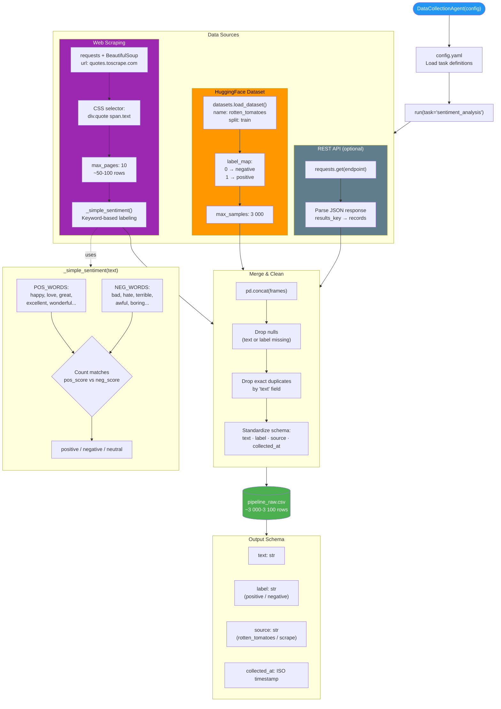

# DataCollectionAgent — Detailed Diagram

```mermaid
flowchart TD
    ENTRY(["DataCollectionAgent(config)"])
    YAML["config.yaml\nLoad task definitions"]

    ENTRY --> YAML

    YAML --> RUN["run(task='sentiment_analysis')"]

    RUN --> SOURCES

    subgraph SOURCES ["Data Sources"]
        direction LR

        subgraph HF ["HuggingFace Dataset"]
            HF1["datasets.load_dataset()\nname: rotten_tomatoes\nsplit: train"]
            HF2["label_map:\n0 → negative\n1 → positive"]
            HF3["max_samples: 3 000"]
            HF1 --> HF2 --> HF3
        end

        subgraph WEB ["Web Scraping"]
            WEB1["requests + BeautifulSoup\nurl: quotes.toscrape.com"]
            WEB2["CSS selector:\ndiv.quote span.text"]
            WEB3["max_pages: 10\n~50-100 rows"]
            WEB4["_simple_sentiment()\nKeyword-based labeling"]
            WEB1 --> WEB2 --> WEB3 --> WEB4
        end

        subgraph API ["REST API (optional)"]
            API1["requests.get(endpoint)"]
            API2["Parse JSON response\nresults_key → records"]
            API1 --> API2
        end
    end

    HF3 --> MERGE
    WEB4 --> MERGE
    API2 --> MERGE

    subgraph MERGE ["Merge & Clean"]
        direction TB
        M1["pd.concat(frames)"]
        M2["Drop nulls\n(text or label missing)"]
        M3["Drop exact duplicates\nby 'text' field"]
        M4["Standardize schema:\ntext · label · source · collected_at"]
        M1 --> M2 --> M3 --> M4
    end

    MERGE --> OUT[("pipeline_raw.csv\n~3 000-3 100 rows")]

    subgraph SCHEMA ["Output Schema"]
        direction LR
        S1["text: str"]
        S2["label: str\n(positive / negative)"]
        S3["source: str\n(rotten_tomatoes / scrape)"]
        S4["collected_at: ISO timestamp"]
    end

    OUT --> SCHEMA

    subgraph SENTIMENT ["_simple_sentiment(text)"]
        direction TB
        SEN1["POS_WORDS:\nhappy, love, great,\nexcellent, wonderful..."]
        SEN2["NEG_WORDS:\nbad, hate, terrible,\nawful, boring..."]
        SEN3{"Count matches\npos_score vs neg_score"}
        SEN4["positive / negative / neutral"]
        SEN1 --> SEN3
        SEN2 --> SEN3
        SEN3 --> SEN4
    end

    WEB4 -.->|uses| SENTIMENT

    style ENTRY fill:#2196F3,color:#fff
    style OUT fill:#4CAF50,color:#fff
    style HF fill:#FF9800,color:#000
    style WEB fill:#9C27B0,color:#fff
    style API fill:#607D8B,color:#fff
```
