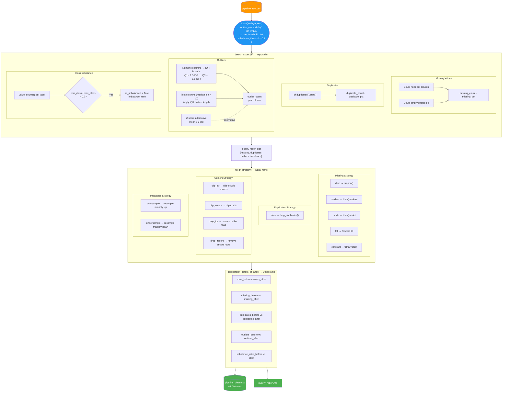

# DataQualityAgent — Detailed Diagram

```mermaid
flowchart TD
    ENTRY(["DataQualityAgent(\n  outlier_method='iqr',\n  iqr_k=1.5,\n  zscore_threshold=3.0,\n  imbalance_threshold=0.7\n)"])

    IN[("pipeline_raw.csv")]
    IN --> ENTRY

    ENTRY --> DETECT

    subgraph DETECT ["detect_issues(df) → report dict"]
        direction TB

        subgraph MISSING ["Missing Values"]
            MI1["Count nulls per column"]
            MI2["Count empty strings ('')"]
            MI3["missing_count · missing_pct"]
            MI1 --> MI3
            MI2 --> MI3
        end

        subgraph DUPES ["Duplicates"]
            DU1["df.duplicated().sum()"]
            DU2["duplicate_count · duplicate_pct"]
            DU1 --> DU2
        end

        subgraph OUTLIERS ["Outliers"]
            direction LR
            OL1["Numeric columns → IQR bounds\nQ1 - 1.5·IQR … Q3 + 1.5·IQR"]
            OL2["Text columns (median len > 10)\nApply IQR on text length"]
            OL3["Z-score alternative\nmean ± 3·std"]
            OL1 --> OL_OUT["outlier_count\nper column"]
            OL2 --> OL_OUT
            OL3 -.->|alternative| OL_OUT
        end

        subgraph IMBALANCE ["Class Imbalance"]
            IM1["value_counts() per label"]
            IM2{"min_class / max_class\n< 0.7?"}
            IM3["is_imbalanced = True\nimbalance_ratio"]
            IM1 --> IM2 -->|Yes| IM3
        end
    end

    DETECT --> REPORT["quality report dict\n{missing, duplicates, outliers, imbalance}"]

    REPORT --> FIX

    subgraph FIX ["fix(df, strategy) → DataFrame"]
        direction TB

        subgraph FIX_M ["Missing Strategy"]
            FM1["drop → dropna()"]
            FM2["median → fillna(median)"]
            FM3["mode → fillna(mode)"]
            FM4["ffill → forward fill"]
            FM5["constant → fillna(value)"]
        end

        subgraph FIX_D ["Duplicates Strategy"]
            FD1["drop → drop_duplicates()"]
        end

        subgraph FIX_O ["Outliers Strategy"]
            FO1["clip_iqr → clip to IQR bounds"]
            FO2["clip_zscore → clip to ±3σ"]
            FO3["drop_iqr → remove outlier rows"]
            FO4["drop_zscore → remove zscore rows"]
        end

        subgraph FIX_I ["Imbalance Strategy"]
            FI1["oversample → resample minority up"]
            FI2["undersample → resample majority down"]
        end
    end

    FIX --> COMPARE

    subgraph COMPARE ["compare(df_before, df_after) → DataFrame"]
        direction LR
        CMP1["rows_before vs rows_after"]
        CMP2["missing_before vs missing_after"]
        CMP3["duplicates_before vs duplicates_after"]
        CMP4["outliers_before vs outliers_after"]
        CMP5["imbalance_ratio_before vs after"]
    end

    COMPARE --> OUT_CLEAN[("pipeline_clean.csv\n~3 000 rows")]
    COMPARE --> OUT_REPORT["quality_report.md"]

    style ENTRY fill:#2196F3,color:#fff
    style IN fill:#FF9800,color:#fff
    style OUT_CLEAN fill:#4CAF50,color:#fff
    style OUT_REPORT fill:#4CAF50,color:#fff
```
