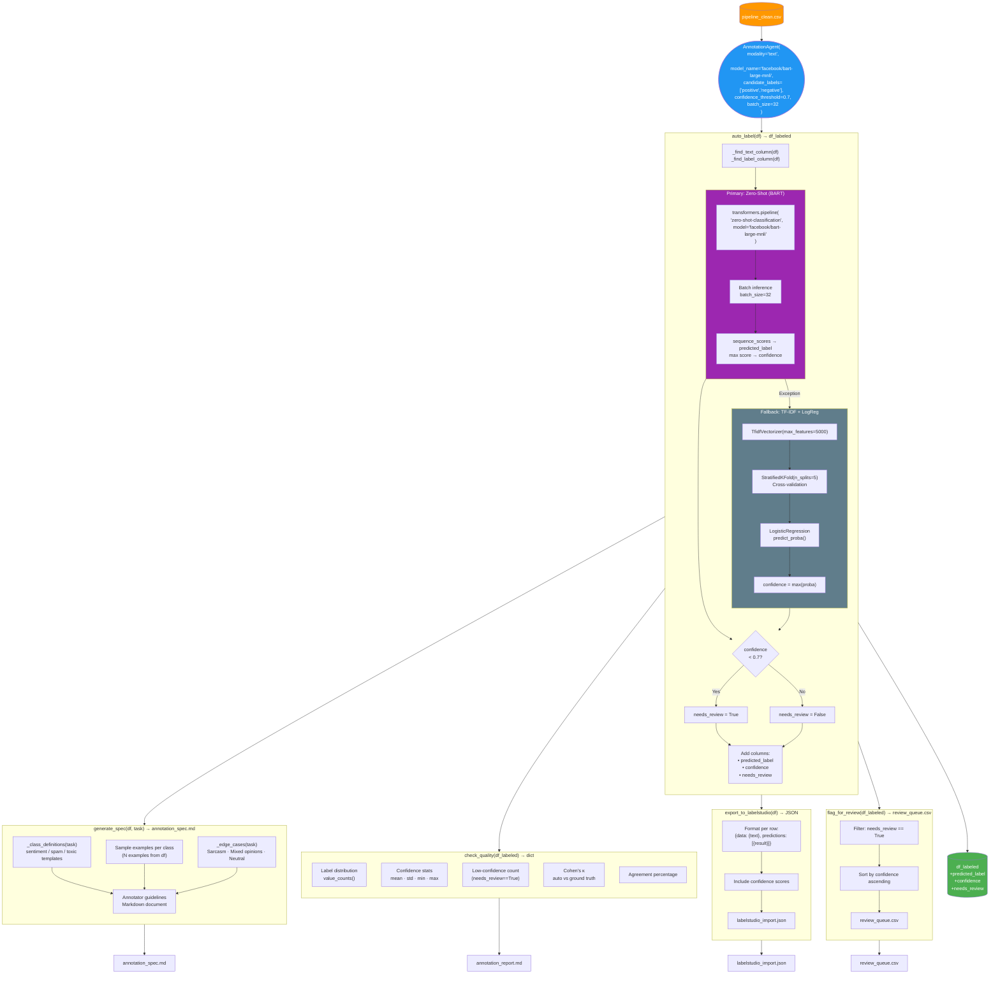

# AnnotationAgent — Detailed Diagram

```mermaid
flowchart TD
    ENTRY(["AnnotationAgent(\n  modality='text',\n  model_name='facebook/bart-large-mnli',\n  candidate_labels=['positive','negative'],\n  confidence_threshold=0.7,\n  batch_size=32\n)"])

    IN[("pipeline_clean.csv")]
    IN --> ENTRY

    ENTRY --> AUTOLABEL

    subgraph AUTOLABEL ["auto_label(df) → df_labeled"]
        direction TB

        FIND["_find_text_column(df)\n_find_label_column(df)"]

        FIND --> TRY_BART

        subgraph TRY_BART ["Primary: Zero-Shot (BART)"]
            direction TB
            LOAD["transformers.pipeline(\n  'zero-shot-classification',\n  model='facebook/bart-large-mnli'\n)"]
            BATCH["Batch inference\nbatch_size=32"]
            SCORES["sequence_scores → predicted_label\nmax score → confidence"]
            LOAD --> BATCH --> SCORES
        end

        TRY_BART -->|Exception| FALLBACK

        subgraph FALLBACK ["Fallback: TF-IDF + LogReg"]
            direction TB
            FB1["TfidfVectorizer(max_features=5000)"]
            FB2["StratifiedKFold(n_splits=5)\nCross-validation"]
            FB3["LogisticRegression\npredict_proba()"]
            FB4["confidence = max(proba)"]
            FB1 --> FB2 --> FB3 --> FB4
        end

        TRY_BART --> THRESHOLD
        FALLBACK --> THRESHOLD

        THRESHOLD{"confidence\n< 0.7?"}
        THRESHOLD -->|Yes| REVIEW_FLAG["needs_review = True"]
        THRESHOLD -->|No| OK_FLAG["needs_review = False"]

        REVIEW_FLAG --> COLS
        OK_FLAG --> COLS

        COLS["Add columns:\n• predicted_label\n• confidence\n• needs_review"]
    end

    AUTOLABEL --> GENSPEC

    subgraph GENSPEC ["generate_spec(df, task) → annotation_spec.md"]
        direction TB
        GS1["_class_definitions(task)\nsentiment / spam / toxic templates"]
        GS2["Sample examples per class\n(N examples from df)"]
        GS3["_edge_cases(task)\nSarcasm · Mixed opinions · Neutral"]
        GS4["Annotator guidelines\nMarkdown document"]
        GS1 --> GS4
        GS2 --> GS4
        GS3 --> GS4
    end

    AUTOLABEL --> QUALITY

    subgraph QUALITY ["check_quality(df_labeled) → dict"]
        direction TB
        QC1["Label distribution\nvalue_counts()"]
        QC2["Confidence stats\nmean · std · min · max"]
        QC3["Low-confidence count\n(needs_review==True)"]
        QC4["Cohen's κ\nauto vs ground truth"]
        QC5["Agreement percentage"]
    end

    AUTOLABEL --> LABELSTUDIO

    subgraph LABELSTUDIO ["export_to_labelstudio(df) → JSON"]
        direction TB
        LS1["Format per row:\n{data: {text}, predictions: [{result}]}"]
        LS2["Include confidence scores"]
        LS3["labelstudio_import.json"]
        LS1 --> LS2 --> LS3
    end

    AUTOLABEL --> FLAG

    subgraph FLAG ["flag_for_review(df_labeled) → review_queue.csv"]
        direction TB
        FL1["Filter: needs_review == True"]
        FL2["Sort by confidence ascending"]
        FL3["review_queue.csv"]
        FL1 --> FL2 --> FL3
    end

    GENSPEC --> OUT1["annotation_spec.md"]
    QUALITY --> OUT2["annotation_report.md"]
    LABELSTUDIO --> OUT3["labelstudio_import.json"]
    FLAG --> OUT4["review_queue.csv"]
    AUTOLABEL --> OUT5[("df_labeled\n+predicted_label\n+confidence\n+needs_review")]

    style ENTRY fill:#2196F3,color:#fff
    style IN fill:#FF9800,color:#fff
    style OUT5 fill:#4CAF50,color:#fff
    style TRY_BART fill:#9C27B0,color:#fff
    style FALLBACK fill:#607D8B,color:#fff
```
