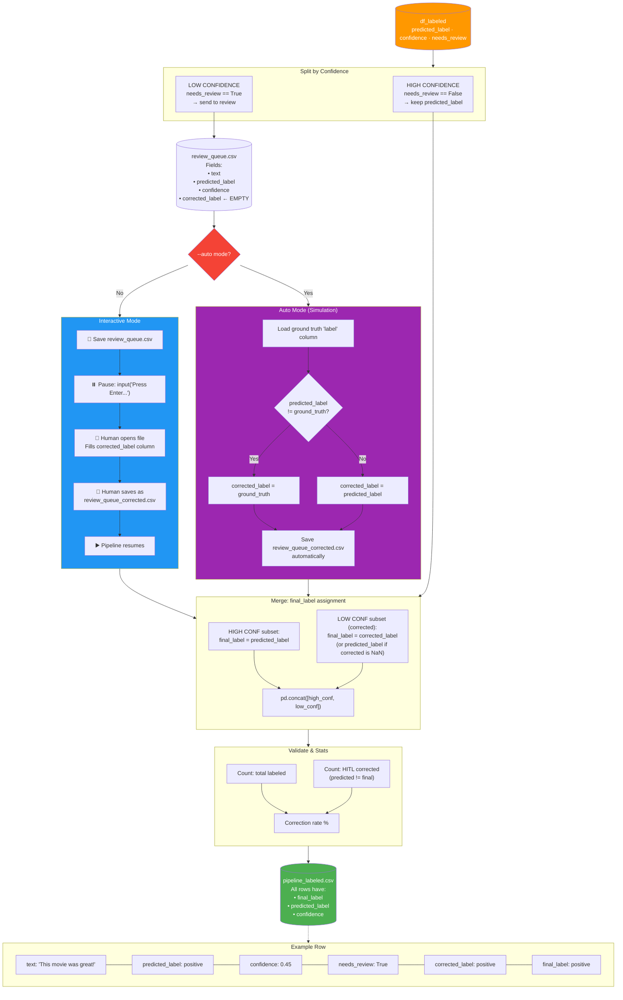

# Human-in-the-Loop (HITL) Workflow — Detailed Diagram

```mermaid
flowchart TD
    IN[("df_labeled\npredicted_label · confidence · needs_review")]

    IN --> SPLIT

    subgraph SPLIT ["Split by Confidence"]
        direction LR
        SP1["HIGH CONFIDENCE\nneeds_review == False\n→ keep predicted_label"]
        SP2["LOW CONFIDENCE\nneeds_review == True\n→ send to review"]
    end

    SP2 --> REVIEW_QUEUE[("review_queue.csv\nFields:\n• text\n• predicted_label\n• confidence\n• corrected_label ← EMPTY")]

    REVIEW_QUEUE --> MODE

    MODE{"--auto mode?"}

    subgraph INTERACTIVE ["Interactive Mode"]
        direction TB
        IR1["💾 Save review_queue.csv"]
        IR2["⏸️ Pause: input('Press Enter...')"]
        IR3["👤 Human opens file\nFills corrected_label column"]
        IR4["💾 Human saves as\nreview_queue_corrected.csv"]
        IR5["▶️ Pipeline resumes"]
        IR1 --> IR2 --> IR3 --> IR4 --> IR5
    end

    subgraph AUTO ["Auto Mode (Simulation)"]
        direction TB
        AU1["Load ground truth 'label' column"]
        AU2{"predicted_label\n!= ground_truth?"}
        AU3["corrected_label = ground_truth"]
        AU4["corrected_label = predicted_label"]
        AU5["Save review_queue_corrected.csv\nautomatically"]
        AU1 --> AU2
        AU2 -->|Yes| AU3 --> AU5
        AU2 -->|No| AU4 --> AU5
    end

    MODE -->|No| INTERACTIVE
    MODE -->|Yes| AUTO

    INTERACTIVE --> MERGE
    AUTO --> MERGE

    subgraph MERGE ["Merge: final_label assignment"]
        direction TB
        MR1["HIGH CONF subset:\nfinal_label = predicted_label"]
        MR2["LOW CONF subset (corrected):\nfinal_label = corrected_label\n(or predicted_label if corrected is NaN)"]
        MR3["pd.concat([high_conf, low_conf])"]
        MR1 --> MR3
        MR2 --> MR3
    end

    SP1 --> MERGE

    MERGE --> VALIDATE

    subgraph VALIDATE ["Validate & Stats"]
        direction TB
        VA1["Count: total labeled"]
        VA2["Count: HITL corrected\n(predicted != final)"]
        VA3["Correction rate %"]
        VA1 --> VA3
        VA2 --> VA3
    end

    VALIDATE --> OUT[("pipeline_labeled.csv\nAll rows have:\n• final_label\n• predicted_label\n• confidence")]

    subgraph EXAMPLE ["Example Row"]
        direction LR
        EX1["text: 'This movie was great!'"]
        EX2["predicted_label: positive"]
        EX3["confidence: 0.45"]
        EX4["needs_review: True"]
        EX5["corrected_label: positive"]
        EX6["final_label: positive"]
        EX1 --- EX2 --- EX3 --- EX4 --- EX5 --- EX6
    end

    OUT -.-> EXAMPLE

    style IN fill:#FF9800,color:#fff
    style OUT fill:#4CAF50,color:#fff
    style INTERACTIVE fill:#2196F3,color:#fff
    style AUTO fill:#9C27B0,color:#fff
    style MODE fill:#F44336,color:#fff
```
