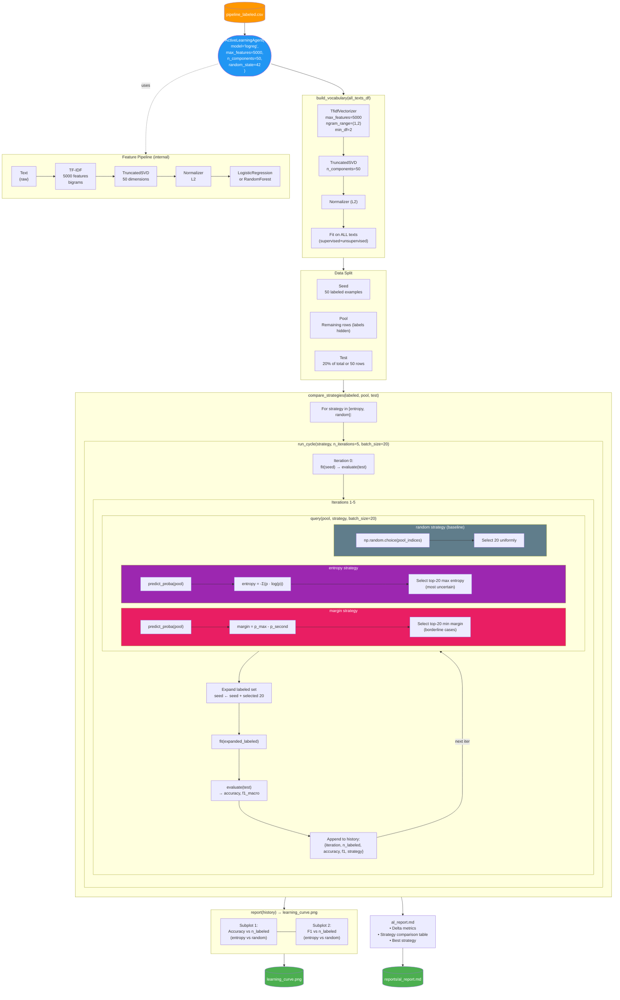

# ActiveLearningAgent — Detailed Diagram

```mermaid
flowchart TD
    ENTRY(["ActiveLearningAgent(\n  model='logreg',\n  max_features=5000,\n  n_components=50,\n  random_state=42\n)"])

    IN[("pipeline_labeled.csv")]
    IN --> ENTRY

    ENTRY --> BUILD_VOC

    subgraph BUILD_VOC ["build_vocabulary(all_texts_df)"]
        direction TB
        BV1["TfidfVectorizer\nmax_features=5000\nngram_range=(1,2)\nmin_df=2"]
        BV2["TruncatedSVD\nn_components=50"]
        BV3["Normalizer (L2)"]
        BV4["Fit on ALL texts\n(supervised+unsupervised)"]
        BV1 --> BV2 --> BV3 --> BV4
    end

    BUILD_VOC --> SPLIT

    subgraph SPLIT ["Data Split"]
        direction LR
        SP1["Seed\n50 labeled examples"]
        SP2["Pool\nRemaining rows (labels hidden)"]
        SP3["Test\n20% of total or 50 rows"]
    end

    SPLIT --> COMPARE_STRAT

    subgraph COMPARE_STRAT ["compare_strategies(labeled, pool, test)"]
        direction TB

        CS_LOOP["For strategy in [entropy, random]:"]
        CS_LOOP --> CYCLE

        subgraph CYCLE ["run_cycle(strategy, n_iterations=5, batch_size=20)"]
            direction TB

            ITER0["Iteration 0:\nfit(seed) → evaluate(test)"]

            ITER0 --> LOOP_START

            subgraph LOOP_START ["Iterations 1-5"]
                direction TB

                subgraph QUERY ["query(pool, strategy, batch_size=20)"]
                    direction LR

                    subgraph ENT ["entropy strategy"]
                        EN1["predict_proba(pool)"]
                        EN2["entropy = -Σ(p · log(p))"]
                        EN3["Select top-20 max entropy\n(most uncertain)"]
                        EN1 --> EN2 --> EN3
                    end

                    subgraph MAR ["margin strategy"]
                        MA1["predict_proba(pool)"]
                        MA2["margin = p_max - p_second"]
                        MA3["Select top-20 min margin\n(borderline cases)"]
                        MA1 --> MA2 --> MA3
                    end

                    subgraph RND ["random strategy (baseline)"]
                        RN1["np.random.choice(pool_indices)"]
                        RN2["Select 20 uniformly"]
                        RN1 --> RN2
                    end
                end

                QUERY --> EXPAND["Expand labeled set\nseed ← seed + selected 20"]
                EXPAND --> REFIT["fit(expanded_labeled)"]
                REFIT --> EVAL["evaluate(test)\n→ accuracy, f1_macro"]
                EVAL --> HISTORY["Append to history:\n{iteration, n_labeled, accuracy, f1, strategy}"]
                HISTORY -->|next iter| QUERY
            end
        end
    end

    COMPARE_STRAT --> REPORT

    subgraph REPORT ["report(history) → learning_curve.png"]
        direction LR
        RP1["Subplot 1:\nAccuracy vs n_labeled\n(entropy vs random)"]
        RP2["Subplot 2:\nF1 vs n_labeled\n(entropy vs random)"]
        RP1 --- RP2
    end

    COMPARE_STRAT --> AL_REPORT["al_report.md\n• Delta metrics\n• Strategy comparison table\n• Best strategy"]

    REPORT --> OUT1[("learning_curve.png")]
    AL_REPORT --> OUT2[("reports/al_report.md")]

    subgraph FEATURE_PIPE ["Feature Pipeline (internal)"]
        direction LR
        FP1["Text\n(raw)"]
        FP2["TF-IDF\n5000 features\nbigrams"]
        FP3["TruncatedSVD\n50 dimensions"]
        FP4["Normalizer\nL2"]
        FP5["LogisticRegression\nor RandomForest"]
        FP1 --> FP2 --> FP3 --> FP4 --> FP5
    end

    ENTRY -.->|uses| FEATURE_PIPE

    style ENTRY fill:#2196F3,color:#fff
    style IN fill:#FF9800,color:#fff
    style OUT1 fill:#4CAF50,color:#fff
    style OUT2 fill:#4CAF50,color:#fff
    style ENT fill:#9C27B0,color:#fff
    style RND fill:#607D8B,color:#fff
    style MAR fill:#E91E63,color:#fff
```
