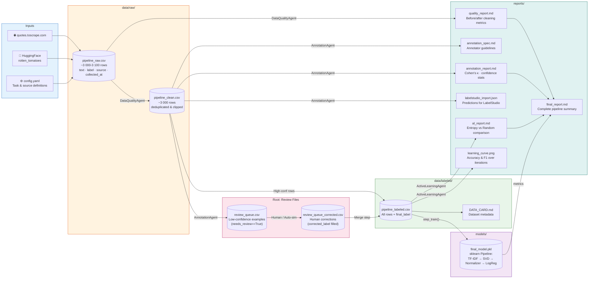

# Data Flow — Files & Artifacts

```mermaid
flowchart LR
    subgraph INPUTS ["Inputs"]
        direction TB
        CFG["⚙️ config.yaml\nTask & source definitions"]
        HF_DS["🤗 HuggingFace\nrotten_tomatoes"]
        WEB["🌐 quotes.toscrape.com"]
    end

    subgraph RAW ["data/raw/"]
        direction TB
        RAW1[("pipeline_raw.csv\n~3 000-3 100 rows\ntext · label · source · collected_at")]
        RAW2[("pipeline_clean.csv\n~3 000 rows\ndeduplicated & clipped")]
    end

    subgraph LABELED ["data/labeled/"]
        direction TB
        LAB1[("pipeline_labeled.csv\nAll rows + final_label")]
        LAB2["DATA_CARD.md\nDataset metadata"]
    end

    subgraph REVIEW ["Root: Review Files"]
        direction TB
        REV1[("review_queue.csv\nLow-confidence examples\n(needs_review==True)")]
        REV2[("review_queue_corrected.csv\nHuman corrections\n(corrected_label filled)")]
    end

    subgraph MODELS ["models/"]
        direction TB
        MDL[("final_model.pkl\nsklearn Pipeline:\nTF-IDF → SVD → Normalizer → LogReg")]
    end

    subgraph REPORTS ["reports/"]
        direction TB
        RP1["quality_report.md\nBefore/after cleaning metrics"]
        RP2["annotation_spec.md\nAnnotator guidelines"]
        RP3["annotation_report.md\nCohen's κ · confidence stats"]
        RP4["labelstudio_import.json\nPredictions for LabelStudio"]
        RP5["al_report.md\nEntropy vs Random comparison"]
        RP6["learning_curve.png\nAccuracy & F1 over iterations"]
        RP7["final_report.md\nComplete pipeline summary"]
    end

    CFG --> RAW1
    HF_DS --> RAW1
    WEB --> RAW1

    RAW1 -->|"DataQualityAgent"| RAW2

    RAW2 -->|"AnnotationAgent"| REV1
    RAW2 -->|"AnnotationAgent"| RP2
    RAW2 -->|"AnnotationAgent"| RP3
    RAW2 -->|"AnnotationAgent"| RP4

    RAW1 -->|"DataQualityAgent"| RP1

    REV1 -->|"Human / Auto-sim"| REV2
    REV2 -->|"Merge step"| LAB1
    RAW2 -->|"High-conf rows"| LAB1

    LAB1 -->|"ActiveLearningAgent"| RP5
    LAB1 -->|"ActiveLearningAgent"| RP6
    LAB1 -->|"step_train()"| MDL

    MDL -->|"metrics"| RP7
    RP5 --> RP7
    RP3 --> RP7
    RP1 --> RP7
    LAB1 --> LAB2

    style INPUTS fill:#E3F2FD,stroke:#1565C0
    style RAW fill:#FFF3E0,stroke:#E65100
    style LABELED fill:#E8F5E9,stroke:#2E7D32
    style REVIEW fill:#FCE4EC,stroke:#AD1457
    style MODELS fill:#F3E5F5,stroke:#6A1B9A
    style REPORTS fill:#E0F2F1,stroke:#00695C
```
