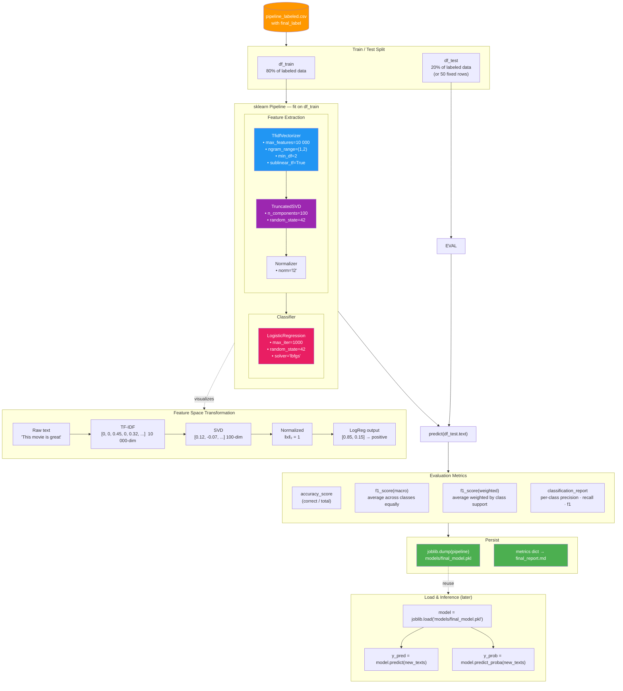

# Model Training — Step 6 Detailed Diagram

```mermaid
flowchart TD
    IN[("pipeline_labeled.csv\nwith final_label")]

    IN --> SPLIT

    subgraph SPLIT ["Train / Test Split"]
        direction LR
        TR["df_train\n80% of labeled data"]
        TE["df_test\n20% of labeled data\n(or 50 fixed rows)"]
    end

    TR --> PIPELINE
    TE --> EVAL

    subgraph PIPELINE ["sklearn Pipeline — fit on df_train"]
        direction TB

        subgraph FEAT ["Feature Extraction"]
            direction TB
            TF["TfidfVectorizer\n• max_features=10 000\n• ngram_range=(1,2)\n• min_df=2\n• sublinear_tf=True"]
            SVD["TruncatedSVD\n• n_components=100\n• random_state=42"]
            NORM["Normalizer\n• norm='l2'"]
            TF --> SVD --> NORM
        end

        subgraph CLF ["Classifier"]
            direction TB
            LR["LogisticRegression\n• max_iter=1000\n• random_state=42\n• solver='lbfgs'"]
        end

        FEAT --> CLF
    end

    PIPELINE --> PREDICT["predict(df_test.text)"]
    EVAL --> PREDICT

    subgraph METRICS ["Evaluation Metrics"]
        direction TB
        M1["accuracy_score\n(correct / total)"]
        M2["f1_score(macro)\naverage across classes equally"]
        M3["f1_score(weighted)\naverage weighted by class support"]
        M4["classification_report\nper-class precision · recall · f1"]
    end

    PREDICT --> METRICS

    METRICS --> SAVE

    subgraph SAVE ["Persist"]
        direction LR
        SAV1["joblib.dump(pipeline)\nmodels/final_model.pkl"]
        SAV2["metrics dict → final_report.md"]
    end

    subgraph LOAD ["Load & Inference (later)"]
        direction TB
        L1["model = joblib.load('models/final_model.pkl')"]
        L2["y_pred = model.predict(new_texts)"]
        L3["y_prob = model.predict_proba(new_texts)"]
        L1 --> L2
        L1 --> L3
    end

    SAV1 -.->|"reuse"| LOAD

    subgraph FEATURE_SPACE ["Feature Space Transformation"]
        direction LR
        FS1["Raw text\n'This movie is great'"]
        FS2["TF-IDF\n[0, 0, 0.45, 0, 0.32, ...]  10 000-dim"]
        FS3["SVD\n[0.12, -0.07, ...]  100-dim"]
        FS4["Normalized\n‖x‖₂ = 1"]
        FS5["LogReg output\n[0.85, 0.15]  → positive"]
        FS1 --> FS2 --> FS3 --> FS4 --> FS5
    end

    PIPELINE -.->|"visualizes"| FEATURE_SPACE

    style IN fill:#FF9800,color:#fff
    style SAV1 fill:#4CAF50,color:#fff
    style SAV2 fill:#4CAF50,color:#fff
    style TF fill:#2196F3,color:#fff
    style SVD fill:#9C27B0,color:#fff
    style LR fill:#E91E63,color:#fff
```
